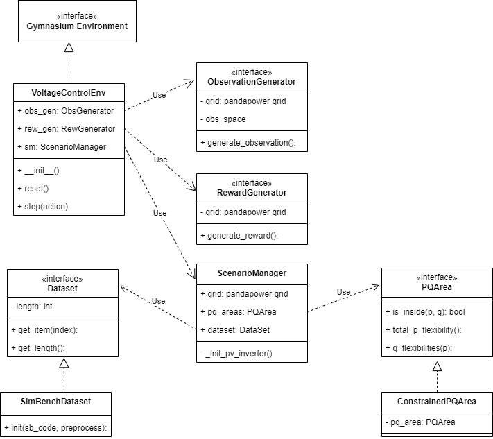

# Voltage Control Env

## <span style="color: red">DISCLAIMER</span>
<p style="color: red">This repository is under heavy development and will most likely change significantly in structure in the near future.</p>

---

## Overview

This repository provides a Gymnasium environment for voltage control task in electrical networks. The repository depends heavily on the [pandapower](https://www.pandapower.org/) library.

Currently two types of environments are supported: ```VoltageControlEnv``` and the variant ```DeltaStepVoltageControlEnv```. The difference is how the agent interacts with the environment. In the former the agent specifies its desired pq-setpoint, while in the variant the agent only specifies a desired change (delta) from the current setpoint.

The structure of the environment can be broadly visualized with this (incomplete and not up-to-date) class diagram:



Currently only the control of sgens (e.g. PVs) is supported. In the near future controllable loads might be included as well.

## Installation

One way to install the package is to clone the repository, activate your virtual environment of choice (e.g. conda), and then run: 

```
pip install -e .
```

